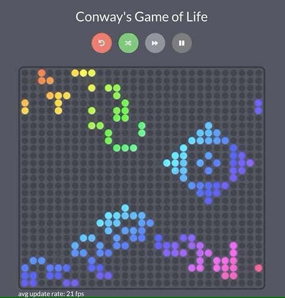

# Reason Game of Life

An educational implementation of [Conway's Game of Life](https://en.wikipedia.org/wiki/Conway%27s_Game_of_Life) in [ReScript](https://rescript-lang.org/) using [ReasonReact](https://reasonml.github.io/reason-react/) and [styled-ppx](https://github.com/davesnx/styled-ppx).

[](https://alanrsoares.github.io/reason-game-of-life)

Live demo at [here](https://alanrsoares.github.io/reason-game-of-life).

## Wanna try it locally?

Clone the repository:

```
git clone git@github.com:alanrsoares/reason-game-of-life.git
```

Install dependencies:

```bash
yarn install
```

Or with npm:

```bash
npm install
```

Run it:

```
yarn start
```

Or with npm:

```bash
npm start
```

### License

[MIT](/LICENSE)
